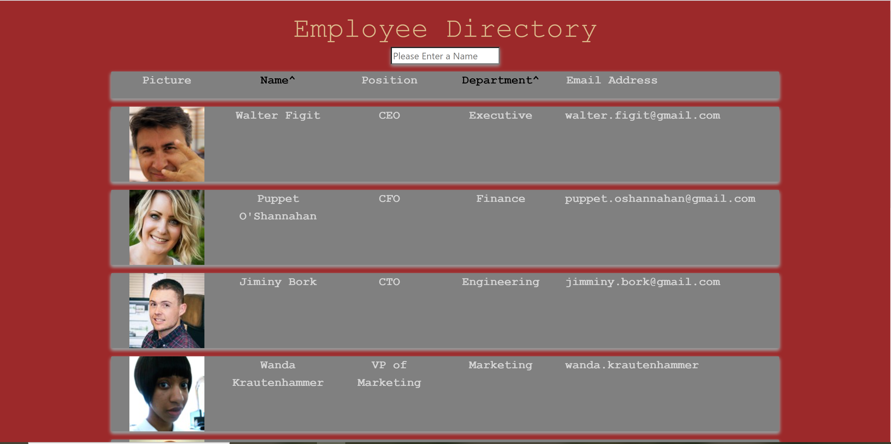

# Employee Directory

Welcome to my Employee directory. Using my application you can easily find the information regarding your employees or coworkers. Using React.jsthe information regarding your employees is automatically rendered on the screen. If you click on either the "name" button or the "department" buttons you can organize your employees alphabetically by either name or department. You can also search for a specific employee by entering their name into the search bar. Please enjoy my application and organize your empolyees/coworkers with eaze.

### Screenshots

## Built With

* [React.js](https://reactjs.org/)
* [Node.js](https://nodejs.org/en/)

## Deployed Link

* [See Live Site](https://perfectoment.github.io/clicking-game/)

## Author

* **Ryan Nemec** 

- [Link to Portfolio Site](https://gentle-shelf-67923.herokuapp.com/portfolio)
- [Link to Github](https://github.com/perfectoment)
- [Link to LinkedIn](https://www.linkedin.com/in/ryan-nemec-5a6b3a66/)
